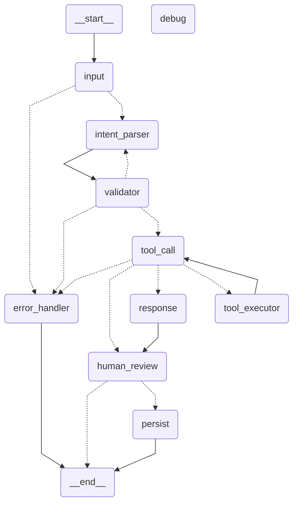

# LangGraph State Machine � Mermaid Diagram

```mermaid
---
config:
  flowchart:
    curve: linear
---
graph TD;
	__start__(<p>__start__</p>)
	input(input)
	intent_parser(intent_parser)
	validator(validator)
	tool_call(tool_call)
	tool_executor(tool_executor)
	response(response)
	human_review(human_review)
	error_handler(error_handler)
	persist(persist)
	debug(debug)
	__end__(<p>__end__</p>)
	__start__ --> input;
	human_review -.-> __end__;
	human_review -.-> persist;
	input -.-> error_handler;
	input -.-> intent_parser;
	intent_parser --> validator;
	response --> human_review;
	tool_call -.-> error_handler;
	tool_call -.-> human_review;
	tool_call -.-> response;
	tool_call -.-> tool_executor;
	tool_executor --> tool_call;
	validator -.-> error_handler;
	validator -.-> intent_parser;
	validator -.-> tool_call;
	error_handler --> __end__;
	persist --> __end__;
	classDef default fill:#f2f0ff,line-height:1.2
	classDef first fill-opacity:0
	classDef last fill:#bfb6fc

```
